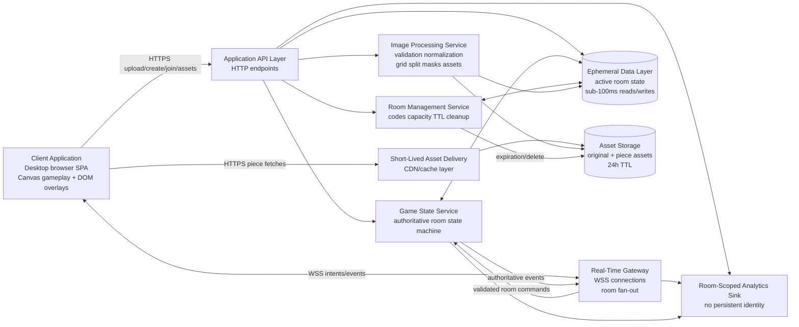
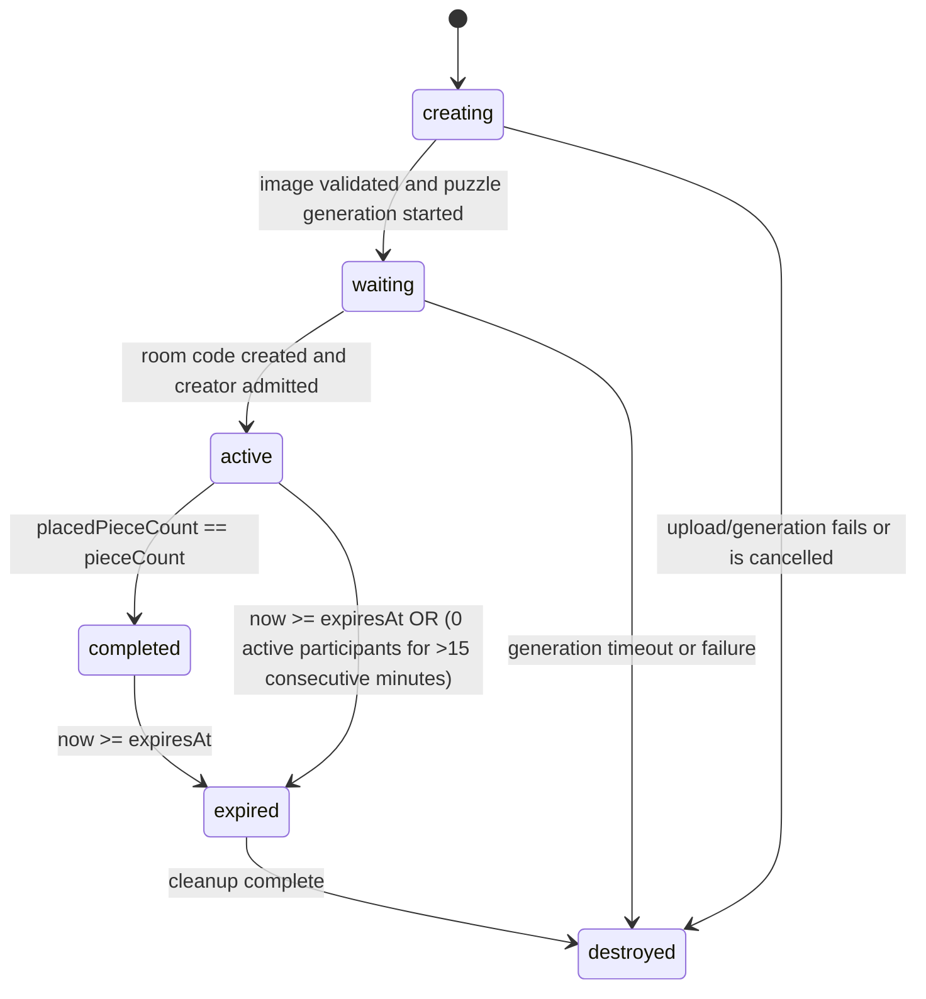

# SquadPuzzle Technical Requirements Document

## 1. Document Information

| Field | Value |
|---|---|
| Project Name | SquadPuzzle |
| Version | 1.1 |
| Status | MVP TRD |
| Author | Principal Engineer / Staff+ Software Architect |
| Last Updated | July 30, 2026 |
| Technical Stakeholders | Engineering Leads, Frontend Engineering, Backend Engineering, Infrastructure, Security, QA |
| Reviewers | Product Management, Design, Engineering Leads, Security, QA |
| Source of Truth | `SquadPuzzle_PRD.md` (product requirements). This document is the technical source of truth for implementation. |

### Document Purpose

This TRD translates the PRD into buildable system design: architecture, data model, APIs, protocols, algorithms, infrastructure, and test strategy. Resolved constants are defined in PRD Section 1 (Glossary); this document must not contradict them.


## 2. Technical Executive Summary

### System Archetype

SquadPuzzle is a real-time collaborative web application with server-authoritative multiplayer state, ephemeral room persistence, user-generated raster image processing, and browser-based rendering. The system must support private 1-6 player rooms, synchronized piece claiming and movement, server-side snap validation, 24-hour retention, and anonymous reconnect within a 60-second lock grace period.

### Key Technical Challenges

- Stateful real-time synchronization: all players in a room must observe the same authoritative piece positions, locks, placements, timer, player list, and completion state.
- Atomic piece locking: simultaneous claims for the same piece must produce exactly one winner and all losers must receive immediate rejection feedback.
- Ephemeral persistence: full room state and assets must survive disconnects for 24 hours, then be permanently deleted.
- Image processing: uploaded images must be validated, normalized, split into deterministic interlocking pieces, and rendered into short-lived assets within the product's upload and generation targets.
- Reconnect correctness: browser refresh, tab suspension, unexpected disconnect, duplicate reconnect, and extended network interruption must hydrate from full server state before interactions resume.
- Desktop rendering performance: up to 100 irregular pieces must remain draggable, selectable, and visually synchronized at low latency on supported desktop browsers.
- Anonymous abuse controls: upload, room creation, join, invalid code attempts, and reconnect attempts must be rate-limited without introducing accounts or persistent identity.

### High-Level Architectural Approach

The architecture uses an HTTP + secure WebSocket hybrid. HTTP handles upload, room creation, joining, metadata fetches, and asset delivery. WebSockets handle room-scoped persistent connections, command submission, authoritative state events, heartbeats, reconnect synchronization, and fan-out.

The Game State Service owns room state transitions and processes commands sequentially per room. This avoids CRDT or operational transform complexity because the product model is not free-form collaborative editing; it is a bounded set of pieces with exclusive locks and server-authoritative placement rules. The design accepts a single authoritative command path per room in exchange for deterministic conflict resolution and zero state divergence.

The Ephemeral Data Layer stores active room state with TTL-native or scheduled deletion semantics. Asset Storage hosts original normalized images and generated piece assets with expiration aligned to room TTL. Application services are horizontally scalable, but each room's command stream is routed to exactly one logical room processor at a time.

### Non-Negotiable Technical Constraints

- Browser-based only; no native application, extension, or plugin is required.
- Desktop-first; supported viewport floor is 1024 x 700 CSS pixels.
- Mouse and keyboard input only; mobile touch gesture systems are out of scope.
- Anonymous access only; no accounts, OAuth, identity providers, passwords, profiles, friend lists, or avatars.
- Room code and display name are the only user-entered join fields.
- Rooms and all associated state and assets expire exactly 24 hours after creation.
- No room extension, archival, export, long-term persistence, or save flow exists.
- Server is the sole authority for piece locks, positions, snap validation, placement, timer, completion, capacity, and expiration.
- Piece rotation, custom grid geometry, non-integer grids, solo mode, spectator mode, racing, replay, leaderboards, achievements, chat, voice, video, monetization, AI-generated puzzles, and image editing pipelines are excluded.

## 3. System Architecture

### High-Level Architecture



### Core Components

Client Application:

- Browser-based frontend for latest two major versions of Chrome, Firefox, Safari, and Edge on desktop.
- Uses mouse events for claim, drag, and release.
- Renders gameplay in a fixed shared workspace with a centered puzzle board, visible scattered piece pool, room code, timer, and player indicators.
- Uses Canvas 2D for puzzle and piece rendering, with DOM for forms, overlays, error dialogs, accessibility labels, room code, timer, and player indicators.
- Maintains local render state but treats server state as authoritative.

Real-Time Gateway:

- Accepts secure WebSocket connections scoped to a room and anonymous player session.
- Handles heartbeat, connection lifecycle, room fan-out, connection draining, and backpressure.
- Does not decide lock, snap, placement, timer, completion, or expiration state.
- Routes commands to the Game State Service and broadcasts authoritative events returned by the state machine.

Application API Layer:

- Handles stateless HTTP endpoints for upload, room creation, join, room metadata, state snapshot fetches, and asset references.
- Enforces request validation, payload size limits, rate limiting, and session-token issuance.
- Delegates authoritative game mutations to the Game State Service.

Game State Service:

- Owns the authoritative per-room state machine.
- Processes room commands sequentially per room.
- Performs atomic lock acquisition, movement validation, snap validation, placement commits, placed-piece counting, completion detection, and lock release.
- Produces ordered room events with monotonic `eventId`.

Image Processing Service:

- Validates JPEG, PNG, WebP, and GIF uploads.
- Rejects unsupported formats, invalid MIME types, mismatched magic numbers, oversized files, undersized images, unsafe decoded dimensions, image bombs, corrupted images, and unsafe color spaces when they cannot be normalized.
- Applies EXIF orientation, strips metadata, normalizes dimensions and color profile, uses the first GIF frame, generates deterministic interlocking masks, renders piece assets, and writes piece metadata.

Room Management Service:

- Generates 8-character case-insensitive room codes from `23456789ABCDEFGHJKMNPQRSTUVWXYZ`.
- Enforces active-room code uniqueness, room capacity of 6 players, 24-hour hard TTL, idle room cleanup (rooms with 0 active participants for >15 consecutive minutes automatically expire early and trigger complete resource cleanup), room expiration, and deletion.
- Coordinates expiration notifications and cleanup.

Ephemeral Data Layer:

- Stores hot active-room state, sessions, locks, placed-piece count, event cursors, and TTL metadata.
- Must support sub-100ms state reads/writes on the critical gameplay path.
- Must support atomic conditional writes or equivalent compare-and-swap operations.

Asset Storage:

- Stores single normalized original base image assets and mask path metadata with expiration aligned to room `expiresAt`.
- Exposes short-lived pre-signed HMAC asset URLs through the API or CDN layer for direct browser Canvas loading.
- Must hard-delete assets at or before room cleanup completion after 24 hours.

### Interaction Patterns

- Client -> Gateway: persistent duplex WebSocket connection per joined room.
- Client -> API: HTTP upload, room creation, join, metadata lookup, and asset retrieval.
- Gateway -> Game State Service: command validation and state mutation.
- Game State Service -> Gateway: authoritative event broadcast for room-scoped fan-out.
- Image Processing -> Asset Storage: generated piece images, normalized source image, and metadata.
- Room Management -> Ephemeral Data Layer: create, validate, join capacity, TTL, expiration, and deletion.
- Game State Service -> Ephemeral Data Layer: atomic state writes and full snapshot reads.
- API/Gateway/Game -> Analytics: room-scoped and session-scoped analytics events only.

## 4. Technology Stack & Rationale

### Frontend

Recommendation:

- TypeScript single-page application using a modern component framework for forms, layout, overlays, and state binding.
- Canvas 2D rendering for puzzle board, pieces, drag motion, z-order, hover, lock, snap, and placed states.
- DOM overlays for accessibility-critical UI: upload flow, join flow, timer, room code, player list, loading overlays, error dialogs, completion overlay, and reconnection overlay.
- Client state split into server state snapshot, local render state, and transient input state.

Rationale:

- Canvas 2D is the best MVP fit for up to 100 irregular image pieces. It avoids the DOM cost of manipulating many clipped irregular elements during frequent movement while remaining simpler than WebGL.
- DOM-only rendering was rejected because irregular masks, piece shadows, z-order changes, and frequent real-time movement are harder to keep performant and consistent across browsers.
- WebGL was rejected for MVP because 100 pieces do not require GPU scene complexity and WebGL adds shader, texture, context-loss, accessibility, and test complexity.
- A component framework is still valuable for non-canvas UI, validation, dialogs, and accessibility.

### Real-Time Transport

Recommendation:

- Secure WebSockets over TLS as the primary and only real-time gameplay transport.
- HTTP remains responsible for stateless operations and asset fetches.

Rationale:

- WebSockets provide low-latency bidirectional communication required for claim, move, release, reconnect, heartbeat, and authoritative event fan-out.
- Server-Sent Events were rejected because they are server-to-client only and would require separate HTTP command submission for every intent, increasing latency and complexity.
- WebRTC data channels were rejected because rooms are small but server authority is mandatory; peer-to-peer state would complicate locking, persistence, moderation boundaries, and reconnect.
- Long-polling is not an MVP gameplay fallback because it cannot reliably meet the perceived real-time movement target. If WebSockets are unavailable, the client shows an unsupported or connection failure state.

### Backend Runtime

Recommendation:

- A high-concurrency backend runtime with efficient WebSocket handling and explicit concurrency primitives. Go is the reference implementation choice for gateway, room management, and game state services.
- CPU-heavy image processing runs in isolated worker processes using native image libraries.

Rationale:

- Go provides efficient concurrent connection handling, predictable memory behavior, and simple deployment for stateful gateway workloads.
- Node.js can satisfy the same product behavior if the team standardizes on TypeScript, but CPU-bound image processing must be isolated from the event loop.
- The design avoids coupling gameplay correctness to a single web server process by persisting room state in the Ephemeral Data Layer and routing commands through room processors.

### Ephemeral State Store

Recommendation:

- Redis-class in-memory data store with TTL support, atomic compare-and-swap semantics (e.g., Lua scripts or SET NX/PX), sorted sets or indexes for expiration scanning, and optional replication.
- Store all room piece states inside a single Redis Hash (`room:{roomId}:pieces`) and all piece locks inside `room:{roomId}:locks` for O(1) single-command atomic state access.

Rationale:

- Gameplay requires sub-100ms state reads and writes; an in-memory store is the correct primary hot-state layer.
- Packing room pieces and locks into Redis Hashes allows atomic single-operation reads/writes, avoiding 100 separate key lookups per state operation.
- A traditional relational database was rejected for active piece movement because high-frequency writes, TTL cleanup, and atomic lock operations would add latency and operational overhead.
- Pure process memory was rejected because active rooms must survive gateway restarts and individual node failures during the 24-hour lifecycle.
- Replication is recommended despite ephemeral data because losing active room state before TTL violates the PRD reliability expectation.

### Asset Storage

Recommendation:

- Object storage for single normalized original base image assets and deterministic mask path metadata, fronted by CDN or cache layer with short TTL cache headers. Base image assets are served via short-lived pre-signed HMAC URLs.

Rationale:

- Serving a single base image asset per room rather than 100 separate pre-rendered piece PNG assets reduces HTTP network requests from 100 down to 1 per room join, dramatically decreasing join latency and CDN bandwidth.
- Using pre-signed HMAC S3/CDN URLs allows standard browser Canvas `Image` elements to load the base image asset directly (`Image.src = url`) without requiring custom `Authorization: Bearer` HTTP headers.
- Client Canvas 2D engine performs in-memory Path2D clipping using deterministic vector mask data and caches rendered pieces on hidden OffscreenCanvas textures.
- Object storage offers lifecycle expiration and cheap short-lived hosting.
- CDN cache headers must not outlive the 24-hour room TTL.

### Image Processing

Recommendation:

- Server-side image manipulation using mature native raster libraries running inside gVisor (`runsc`) sandboxed containers with strict cgroup RAM limits (512 MB) and CPU quotas.
- Mandatory automated CSAM and media safety scanning (e.g., PhotoDNA / PDQ perceptual hashing) on uploaded images before saving normalized assets to public S3 buckets.
- Deterministic mask generation implemented in application code using a seeded pseudo-random generator.

Rationale:

- Client-side image generation was rejected because the server must own puzzle structure and consistent piece assets.
- Mandatory safety scanning ensures illegal or policy-violating media is rejected immediately prior to storage or generation.
- gVisor sandboxing isolates native raster parsing libraries to protect against decompression bombs and untrusted byte execution.

### Room Code Generation

Recommendation:

- Cryptographically secure random generation of an 8-character uppercase code using the character set `23456789ABCDEFGHJKMNPQRSTUVWXYZ` ($31^8 = 852{,}891{,}037{,}441 \approx 853\text{ billion}$ combinations).
- Codes are normalized to uppercase and compared case-insensitively.
- Active-room uniqueness is enforced by an atomic insert-if-absent operation.

Rationale:

- The 8-character code acts as an unguessable capability token for room access; predictable or sequential codes would enable unauthorized join attempts.
- Excluding `0`, `1`, `I`, `L`, and `O` reduces verbal and visual errors.
- Collision handling by regeneration is sufficient for MVP because the active code space is large relative to expected active rooms.

## 5. Data Model & Schema

### Design Principles

- Store only the state required for the 24-hour room lifecycle.
- Keep data room-scoped and session-scoped.
- Do not store persistent identity, profiles, friends, avatars, long-term history, or social graph data.
- Use denormalized snapshots for fast join and reconnect.

### Entity: Room

| Field | Type | Required | Description |
|---|---|---:|---|
| `roomId` | string | Yes | Internal unique room identifier. |
| `code` | string | Yes | 8-character uppercase code from allowed character set. |
| `status` | enum | Yes | `creating`, `waiting`, `active`, `completed`, `expired`, `destroyed`. |
| `createdAt` | timestamp | Yes | Server-authoritative creation time. |
| `expiresAt` | timestamp | Yes | Exactly 24 hours after `createdAt`. |
| `firstClaimedAt` | timestamp/null | No | Server time of first successful piece claim (`piece_locked` event); starts solve timer. |
| `gridSize` | integer | Yes | Integer grid size 4 through 10. |
| `pieceCount` | integer | Yes | `gridSize * gridSize`. |
| `playerCount` | integer | Yes | Current admitted active player count (max 6 active). |
| `completionState` | object | Yes | Completion flag, placed count, completedAt, solveTime. |
| `solveTime` | duration/null | No | Final solve time after completion (`completedAt - firstClaimedAt`). |
| `creatorSessionId` | string | Yes | Anonymous session ID of creator; not a privileged host role after creation. |
| `idleTimerStartedAt` | timestamp/null | No | Server timestamp when active connected player count dropped to 0; triggers 15-minute early expiration when set. |
| `assetId` | string | Yes | Reference to generated image assets. |

Primary key:

- `room:{roomId}`.

Unique constraints:

- `room_code:{code}` must be unique while room status is not `expired` or `destroyed`.

TTL policy:

- `expiresAt = createdAt + 24h`.
- Room record, code index, player sessions, locks, pieces, event log, and assets are deleted at expiration cleanup.

### Entity: Player Session

| Field | Type | Required | Description |
|---|---|---:|---|
| `sessionId` | string | Yes | Anonymous, room-scoped session identifier. |
| `roomId` | string | Yes | Room association. |
| `displayName` | string | Yes | Sanitized ephemeral display name. |
| `displayDisambiguator` | string/null | No | Session-local sequential numeric disambiguator suffix (e.g. `Sam (2)`). Assigned monotonically from room-scoped per-name counter (`nameCounters[displayName]++`), never recycled or reassigned when players leave, and immutable for the duration of the session. |
| `connectedAt` | timestamp | Yes | Last successful connection start time. |
| `lastSeenAt` | timestamp | Yes | Last heartbeat or command time. |
| `gracePeriodExpiry` | timestamp/null | No | Set to disconnect time + 60 seconds. |
| `connectionState` | enum | Yes | `connected`, `grace`, `disconnected`, `left`. |
| `connectionId` | string/null | No | Current gateway connection. |

Primary key:

- `session:{roomId}:{sessionId}`.

Constraints:

- Session belongs to exactly one room.
- Display names need not be unique.
- Up to 6 active connected sessions are allowed per room. Disconnected sessions in grace status do not count toward the 6-player active capacity limit. If a 7th player joins while 6 players are active and 1 is in grace, the oldest grace session is evicted and its locks are released.
- A duplicate reconnect for the same session resolves to one active connection.

TTL policy:

- Same expiration as the room.

### Entity: Piece

| Field | Type | Required | Description |
|---|---|---:|---|
| `pieceId` | string | Yes | Stable piece identifier within room. |
| `roomId` | string | Yes | Room association. |
| `gridX` | integer | Yes | Target column, 0-indexed. |
| `gridY` | integer | Yes | Target row, 0-indexed. |
| `isEdgePiece` | boolean | Yes | True when piece is on puzzle perimeter. |
| `correctPositionX` | integer | Yes | Normalized logical workspace coordinate (-5000 to 15000 scale, board at 0 to 10000). Represents center point of piece bounding box. |
| `correctPositionY` | integer | Yes | Normalized logical workspace coordinate (-5000 to 15000 scale, board at 0 to 10000). Represents center point of piece bounding box. |
| `currentPositionX` | integer | Yes | Current normalized logical workspace coordinate (-5000 to 15000 scale). Represents center point of piece bounding box. |
| `currentPositionY` | integer | Yes | Current normalized logical workspace coordinate (-5000 to 15000 scale). Represents center point of piece bounding box. |
| `zIndex` | integer | Yes | Server-authoritative movable-piece z-order. |
| `placedAt` | timestamp/null | No | Set when snapped and placed. |
| `placedBy` | string/null | No | Anonymous session ID that placed the piece. |
| `bounds` | object | Yes | Width, height, and mask bounds in logical units. |

Primary key & Storage Layout:

- **Static Piece Attributes:** Stored inside Redis Hash `room:{roomId}:pieces_static` (`gridX`, `gridY`, `correctPositionX`, `correctPositionY`, `isEdgePiece`, `bounds`).
- **High-Frequency Coordinate Updates:** Transient coordinates (`currentPositionX`, `currentPositionY`) stored in a lightweight Redis Bitfield or packed binary hash (`room:{roomId}:piece_positions`) to avoid serializing/deserializing full JSON strings during 15Hz movement ticks.

Constraints:

- One piece per grid cell.
- `pieceCount = gridSize * gridSize`.
- Placed pieces cannot be locked, moved, released, or unplaced.

TTL policy:

- Same expiration as room.

### Entity: Piece Lock

| Field | Type | Required | Description |
|---|---|---:|---|
| `pieceId` | string | Yes | Piece association. |
| `roomId` | string | Yes | Room association. |
| `lockedBySessionId` | string/null | No | Owner session while active or in grace. |
| `acquiredAt` | timestamp/null | No | Server time of lock acquisition. |
| `lastMovedAt` | timestamp/null | No | Server time of most recent positional movement for 90s AFK auto-release tracking. |
| `lockState` | enum | Yes | `active`, `grace`, `released`. |
| `graceExpiresAt` | timestamp/null | No | Lock release time when owner disconnects. |

Primary key & Storage Layout:

- Packed Hash Field `pieceId` inside Redis Hash `room:{roomId}:locks`. Lock acquisition, movement timestamp updates, and AFK releases use atomic Redis Lua scripts compare-and-swap.

Constraints:

- At most one active or grace lock per piece.
- Lock cannot exist for a placed piece.
- Lock acquisition requires atomic compare-and-swap from no active lock to active lock.

TTL policy:

- Same expiration as room, with lock-specific grace expiration at 60 seconds after owner disconnect, and automatic lock release after 90 seconds of zero movement.

### Entity: Image Asset

| Field | Type | Required | Description |
|---|---|---:|---|
| `assetId` | string | Yes | Asset group identifier. |
| `roomId` | string | Yes | Room association. |
| `originalUrl` | string | Yes | Short-lived normalized original base asset URL (pre-signed HMAC URL). |
| `maskMetadataUrl` | string | Yes | Short-lived URL or inline JSON for deterministic piece edge path definitions. |
| `generatedAt` | timestamp | Yes | Server time generation completed. |
| `expiresAt` | timestamp | Yes | Same as room expiration. |
| `sourceHash` | string | Yes | Hash of normalized image bytes used for deterministic generation. |
| `imageWidth` | integer | Yes | Processed image width. |
| `imageHeight` | integer | Yes | Processed image height. |

Primary key:

- `asset:{roomId}:{assetId}`.

TTL policy:

- Object storage lifecycle expiration at or before room cleanup completion.
- CDN cache TTL must not exceed room `expiresAt`.

### Serialization & Transport Protocol

Recommendation:

- Unified binary Protobuf protocol (`0x02`) over WebSockets for all client intents and server events, wrapped in a top-level `GameMessage` union schema.
- Eliminates text/binary JSON-Protobuf multiplexing overhead.
- All messages include `schema_version = 1` for protocol versioning and safe rolling deployments.

Protobuf schema definition (`game_protocol.proto`):

```protobuf
syntax = "proto3";
package squadpuzzle;

message ConnectIntent {
  string room_code = 1;
  string session_token = 2;
}

message ClaimPieceIntent {
  string piece_id = 1;
  string client_message_id = 2;
}

message MovePieceIntent {
  string piece_id = 1;
  sint32 position_x = 2; // -5000 to 15000 logical workspace scale
  sint32 position_y = 3; // -5000 to 15000 logical workspace scale
  uint64 client_timestamp = 4;
}

message ReleasePieceIntent {
  string piece_id = 1;
  string client_message_id = 2;
}

message HeartbeatIntent {
}

message ReconnectSyncIntent {
  string client_message_id = 1;
}

message LeaveRoomIntent {
  string client_message_id = 1;
}

message PieceLockedEvent {
  string piece_id = 1;
  string player_session_id = 2;
  string player_name = 3;
  string display_disambiguator = 4;
  uint32 z_index = 5;
}

message RoomMovementTick {
  uint64 tick_id = 1;
  repeated MovePieceIntent moves = 2;
}

message PiecePlacedEvent {
  string piece_id = 1;
  sint32 position_x = 2; // -5000 to 15000 logical workspace scale
  sint32 position_y = 3; // -5000 to 15000 logical workspace scale
  string player_session_id = 4;
  bool is_correct_position = 5;
  uint64 placed_at = 6;
}

message PieceReleasedEvent {
  string piece_id = 1;
  sint32 position_x = 2; // -5000 to 15000 logical workspace scale
  sint32 position_y = 3; // -5000 to 15000 logical workspace scale
  string release_reason = 4; // "manual", "afk", "grace_expired", "disconnect"
}

message PlayerJoinedEvent {
  string player_session_id = 1;
  string player_name = 2;
  string display_disambiguator = 3;
  uint32 player_count = 4;
}

message PlayerLeftEvent {
  string player_session_id = 1;
  string reason = 2;
  uint64 grace_period_expiry = 3;
}

message RoomCompletedEvent {
  uint64 solve_time_ms = 1;
  uint64 completed_at = 2;
}

message RoomExpiredEvent {
  uint64 expired_at = 1;
}

message RoomExpiringSoonEvent {
  uint64 expires_at = 1;
  uint64 remaining_ms = 2;
}

message ErrorEvent {
  string code = 1;
  string message = 2;
  string context_piece_id = 3;
}

message PieceState {
  string piece_id = 1;
  sint32 current_position_x = 2; // -5000 to 15000 logical workspace scale
  sint32 current_position_y = 3; // -5000 to 15000 logical workspace scale
  uint32 z_index = 4;
  bool placed = 5;
  string locked_by_session_id = 6;
}

message PlayerState {
  string session_id = 1;
  string display_name = 2;
  string display_disambiguator = 3;
  string connection_state = 4;
}

message LockState {
  string piece_id = 1;
  string locked_by_session_id = 2;
  string lock_state = 3;
}

message RoomStateSnapshot {
  uint64 last_event_id = 1;
  uint32 grid_size = 2;
  uint32 piece_count = 3;
  uint32 placed_piece_count = 4;
  bool completed = 5;
  uint64 solve_time_ms = 6;
  string base_image_url = 7;
  string mask_metadata_url = 8;
  repeated PieceState pieces = 9;
  repeated PlayerState players = 10;
  repeated LockState locks = 11;
}

message GameMessage {
  uint32 schema_version = 1;
  string room_id = 2;
  uint64 event_id = 3;
  uint64 server_time = 4;

  oneof payload {
    ConnectIntent connect_intent = 10;
    ClaimPieceIntent claim_piece_intent = 11;
    MovePieceIntent move_piece_intent = 12;
    ReleasePieceIntent release_piece_intent = 13;
    HeartbeatIntent heartbeat_intent = 14;
    ReconnectSyncIntent reconnect_sync_intent = 15;
    LeaveRoomIntent leave_room_intent = 16;

    PieceLockedEvent piece_locked_event = 20;
    RoomMovementTick room_movement_tick = 21;
    PiecePlacedEvent piece_placed_event = 22;
    PieceReleasedEvent piece_released_event = 23;
    PlayerJoinedEvent player_joined_event = 24;
    PlayerLeftEvent player_left_event = 25;
    RoomCompletedEvent room_completed_event = 26;
    RoomExpiredEvent room_expired_event = 27;
    RoomExpiringSoonEvent room_expiring_soon_event = 30;
    ErrorEvent error_event = 28;
    RoomStateSnapshot room_state_snapshot = 29;
  }
}
```

## 6. API Specifications

### HTTP Endpoints

All HTTP endpoints require HTTPS. Responses use JSON unless returning binary assets. Errors use a standard error envelope:

```json
{
  "error": {
    "code": "ROOM_FULL",
    "message": "Room is full.",
    "context": {
      "roomCode": "ABC23489"
    },
    "retryable": false
  }
}
```

#### `POST /upload`

Purpose:

- Validate and stage an image upload before room creation.

Request:

- `multipart/form-data`
- Field `image`: one file.

Validation:

- Max upload size: 10 MB.
- Accepted formats: JPEG, PNG, WebP, GIF.
- Minimum resolution: shortest side >= 800 px.
- Maximum post-orientation dimension: no side > 6000 px unless safely downscaled.
- Aspect ratio validation: Reject images with aspect ratio < 0.5 or > 2.0 with error code `INVALID_ASPECT_RATIO`.
- Reject invalid MIME types, magic number mismatch, unsupported formats, image bombs, unsafe decoded dimensions, corrupted data, and unsupported color spaces that cannot be normalized.
- Apply EXIF orientation and strip metadata.
- **Upload Expiration TTL:** Upload TTL is exactly 10 minutes from upload completion. Expired uploads are deleted via S3 lifecycle rules and the `uploadId` becomes invalid.

Success response:

```json
{
  "uploadId": "upl_123",
  "image": {
    "format": "jpeg",
    "width": 2400,
    "height": 1600,
    "aspectRatio": 1.5
  },
  "expiresAt": "2026-07-30T12:10:00.000Z"
}
```

Delivery:

- Stateless HTTP request-response.
- Retried uploads create a new `uploadId`; cancelled upload does not create room state.

#### `POST /rooms`

Purpose:

- Create a room from a validated upload and selected grid size. This triggers puzzle generation if not already completed for the upload.

Request:

- Header `Idempotency-Key: <UUID>`

```json
{
  "uploadId": "upl_123",
  "gridSize": 8,
  "displayName": "Sam"
}
```

Validation:

- `gridSize` must be integer 4 through 10.
- `displayName` must pass sanitization and length limits.
- Upload must be valid and not expired.
- Room creation rate limit applies.
- **Idempotency Validation:** Idempotency keys are stored in Redis for 24 hours. If a duplicate key is detected, the original room response is returned. If a duplicate key is sent with a different request body, return 409 Conflict.

Success response:

```json
{
  "room": {
    "roomId": "room_123",
    "code": "ABC23489",
    "status": "active",
    "createdAt": "2026-07-30T12:00:00.000Z",
    "expiresAt": "2026-07-31T12:00:00.000Z",
    "gridSize": 8,
    "pieceCount": 64
  },
  "session": {
    "sessionId": "sess_123",
    "token": "opaque-room-scoped-token",
    "displayName": "Sam"
  },
  "webSocketUrl": "wss://example.com/realtime"
}
```

Note: Room code and authentication token are passed inside the initial binary Protobuf `ConnectIntent` frame payload upon WebSocket connection open, preventing token leakage into web server access logs.

Failure codes:

- `INVALID_UPLOAD`, `UPLOAD_EXPIRED`, `INVALID_GRID_SIZE`, `INVALID_DISPLAY_NAME`, `GENERATION_TIMEOUT`, `PROCESSING_FAILED`, `RATE_LIMITED`, `SERVER_UNAVAILABLE`.

Delivery:

- Request-response.
- Duplicate submissions for the same creation attempt must be idempotent and create at most one room.

#### `GET /rooms/:code/assets`

Purpose:

- Refresh short-lived pre-signed HMAC asset URLs for active room sessions.

Request:

- Header `Authorization: Bearer <sessionToken>`

Validation:

- Room exists and session token is valid for the room.

Success response:

```json
{
  "assets": {
    "baseImageUrl": "https://example.com/assets/base.jpg?signature=new_hmac",
    "maskMetadataUrl": "https://example.com/assets/masks.json?signature=new_hmac",
    "expiresAt": "2026-07-30T16:00:00.000Z"
  }
}
```

Delivery:

- Request-response over HTTPS.
- Pre-signed HMAC S3/CDN URLs are issued with a 4-hour lifespan. Clients must refresh asset URLs proactively when the current URL is within 15 minutes of expiration, or reactively upon receiving a 403 Forbidden response. The server returns new pre-signed URLs with a fresh 4-hour lifespan on each request without interrupting the session or leaving the room.

#### `GET /rooms/:code`

Purpose:

- Validate room code and return room metadata and optionally current state snapshot for join preview or reconnect.

Path parameters:

- `code`: case-insensitive room code. Normalize by trimming spaces and converting to uppercase.

Success response:

```json
{
  "room": {
    "roomId": "room_123",
    "code": "ABC23489",
    "status": "active",
    "expiresAt": "2026-07-31T12:00:00.000Z",
    "gridSize": 8,
    "pieceCount": 64,
    "playerCount": 3,
    "capacity": 6,
    "completed": false
  }
}
```

Failure codes:

- `ROOM_NOT_FOUND`, `ROOM_EXPIRED`, `RATE_LIMITED`.

Delivery:

- Request-response.
- Must not reveal extra detail useful for brute-force code enumeration beyond required user-facing failure reason.

#### `POST /rooms/:code/join`

Purpose:

- Admit an anonymous player to an active room and return a room-scoped session token.

Request:

```json
{
  "displayName": "Ari",
  "reconnectSessionId": "sess_123"
}
```

Validation:

- Room exists, is active or completed but not expired, and has capacity.
- Display name passes sanitization.
- Duplicate display names are allowed with session-local disambiguation.
- Join rate limit applies.

Success response:

```json
{
  "session": {
    "sessionId": "sess_456",
    "token": "opaque-room-scoped-token",
    "displayName": "Ari",
    "displayDisambiguator": "2"
  },
  "roomStateSnapshot": {
    "room": {
      "roomId": "room_123",
      "code": "ABC23489",
      "status": "active",
      "gridSize": 8,
      "pieceCount": 64,
      "placedPieceCount": 12,
      "completed": false
    },
    "players": [
      {
        "sessionId": "sess_456",
        "displayName": "Ari",
        "displayDisambiguator": "2",
        "connectionState": "connected"
      }
    ],
    "pieces": [
      {
        "pieceId": "piece_12",
        "currentPositionX": 2500,
        "currentPositionY": 3100,
        "zIndex": 88,
        "placed": false,
        "lockedBySessionId": "sess_456"
      }
    ],
    "locks": [
      {
        "pieceId": "piece_12",
        "lockedBySessionId": "sess_456",
        "lockState": "active"
      }
    ],
    "assets": {
      "baseImageUrl": "https://example.com/assets/base.jpg",
      "maskMetadataUrl": "https://example.com/assets/masks.json"
    }
  },
  "webSocketUrl": "wss://example.com/realtime"
}
```

Failure codes:

- `INVALID_CODE`, `ROOM_FULL`, `ROOM_EXPIRED`, `INVALID_DISPLAY_NAME`, `JOIN_TIMEOUT`, `RATE_LIMITED`.

Delivery:

- Request-response.
- Join and snapshot must complete before gameplay interactions are enabled.

### Real-Time Protocol

Connection:

- `wss://example.com/realtime`
- Authentication token and room code are passed inside the initial binary Protobuf `ConnectIntent` frame payload upon connection open, preventing token leakage in server access logs.
- Gateway validates room, session, expiration, capacity state, and token scope before subscribing connection to room fan-out.

All real-time communication uses the unified binary Protobuf `GameMessage` schema defined in Section 5.

#### Client -> Server Intents

| Message Type | Payload Fields | Delivery Guarantee | Idempotency |
|---|---|---|---|
| `ConnectIntent` | `room_code`, `session_token` | Exactly-once handshake. | Evaluated upon socket open. Invalid token closes socket. |
| `ClaimPieceIntent` | `piece_id`, `client_message_id` | At-least-once from client perspective due to retries; exactly-once state transition by server CAS. | `client_message_id` required. Duplicate claim from same session returns prior result. |
| `MovePieceIntent` | `piece_id`, `position_x`, `position_y`, `client_timestamp` | At-most-once for individual move deltas; latest valid server state wins. | Stale moves are dropped. |
| `ReleasePieceIntent` | `piece_id`, `client_message_id` | At-least-once from client perspective; exactly-once release/snap state transition by server idempotency. | `client_message_id` required. Duplicate release cannot place or release twice. |
| `HeartbeatIntent` | None | Best-effort. | Updates session `lastSeenAt`. |
| `ReconnectSyncIntent` | `client_message_id` | At-least-once from client perspective; server returns full snapshot. | `client_message_id` required. Duplicate reconnect resolves to one active session. |
| `LeaveRoomIntent` | `client_message_id` | At-least-once from client perspective; exactly-once session transition. | `client_message_id` required. |

Coordinate validation:

- `position_x` and `position_y` must be finite integers on the normalized logical workspace scale (-5000 to 15000; board occupies 0 to 10000).
- Movement is accepted only for the session that currently owns the active lock.
- Movement outside workspace drag boundaries is clamped or rejected so at least 40% of the piece bounding box remains within visible workspace bounds.

#### Server -> Client Authoritative Events

| Message Type | Payload Fields | Delivery Guarantee | Idempotency / Ordering |
|---|---|---|---|
| `RoomStateSnapshot` | `room`, `players`, `pieces`, `locks`, `assets`, `last_event_id` | At-least-once on join/reconnect. | Snapshot supersedes prior local state. |
| `PieceLockedEvent` | `piece_id`, `player_session_id`, `player_name`, `display_disambiguator`, `z_index` | At-least-once for lock state. | Apply only if `event_id` is newer than local event cursor. |
| `RoomMovementTick` | `tick_id`, `moves` (`repeated MovePieceIntent`) | At-most-once for movement deltas. | Ordered per tick loop; stale `tick_id` ignored. Echo-suppressed for dragging session. |
| `PiecePlacedEvent` | `piece_id`, `position_x`, `position_y`, `player_session_id`, `is_correct_position`, `placed_at` | At-least-once for placement. | Idempotent by `piece_id` placed state. |
| `PieceReleasedEvent` | `piece_id`, `position_x`, `position_y` | At-least-once for lock release. | Idempotent if piece already unlocked. |
| `PlayerJoinedEvent` | `player_session_id`, `player_name`, `display_disambiguator`, `player_count` | At-least-once. | Idempotent by session ID. |
| `PlayerLeftEvent` | `player_session_id`, `reason`, `grace_period_expiry` | At-least-once. | Idempotent by session state and event ID. |
| `RoomCompletedEvent` | `solve_time_ms`, `completed_at` | At-least-once. | Idempotent by room completed state. |
| `RoomExpiredEvent` | `expired_at` | At-least-once where connection exists. | Terminal state; client leaves room. |
| `RoomExpiringSoonEvent` | `expires_at`, `remaining_ms` | Best-effort to connected clients. | Non-terminal; informational only; may be missed during disconnect. |
| `ErrorEvent` | `code`, `message`, `context_piece_id` | At-least-once for command errors. | Correlate to client intent. |

Delivery model:

- WebSockets provide ordered delivery per active connection, but reconnection breaks transport continuity.
- Critical state changes are made idempotent and recoverable via `RoomStateSnapshot`.
- Movement deltas are intentionally at-most-once because the next move or snapshot supersedes missed positions.
- Lock, release, placement, completion, join, leave, expiration, and reconnect events are at-least-once at the protocol level and exactly-once at the state-transition level.

## 7. Real-Time Synchronization & State Management

### Server-Authoritative State Machine

Each room has one logical command processor. This can be implemented with a per-room actor, a single-threaded room loop, a partitioned command queue, or atomic store operations with strict per-room ordering. The implementation must guarantee that two commands for the same room are not committed out of order in a way that causes divergent lock, placement, or completion state.

Command processing flow:

1. Gateway authenticates the anonymous session token and validates room scope.
2. Gateway forwards the intent to the room processor.
3. Room processor loads current room state or uses its hot in-memory room cache backed by the Ephemeral Data Layer.
4. Room processor validates command preconditions.
5. Room processor applies a single atomic state mutation.
6. Room processor increments `lastEventId`.
7. Room processor persists the mutation.
8. Room processor returns an authoritative event or command error to the Gateway.
9. Gateway broadcasts the event to active room connections.

### Lock Acquisition Algorithm

For `claim_piece`:

1. Validate room exists and is not expired.
2. Validate room is not completed.
3. Validate session belongs to the room and is connected.
4. Validate piece exists and is not placed.
5. Read lock state for `pieceId`.
6. If no active or grace lock exists, atomically set:
   - `lockedBySessionId = sessionId`
   - `lockState = active`
   - `acquiredAt = now`
   - `graceExpiresAt = null`
7. If lock is already held by the same connected session, return existing lock state idempotently.
8. If lock is held by another session, reject with `LOCK_CONFLICT`.
9. Increment piece z-order and emit `piece_locked`. On first piece lock in a room, set `firstClaimedAt = now` on the Room entity to start the solve timer.

Atomicity requirement:

- Step 6 must be compare-and-swap or equivalent. Two simultaneous claims must result in exactly one committed lock.

### AFK Inactivity Lock Auto-Release

1. The Game State Service tracks a `last_moved_at` timestamp in Redis for every active piece lock.
2. The timestamp is updated whenever a valid `MovePieceIntent` is processed for that piece.
3. If a locked piece undergoes zero positional movement for 90 seconds while held by a connected player, the server automatically releases the lock.
4. The server emits a `PieceReleasedEvent` broadcast (with `release_reason = "afk"`) to all room clients, sets `lockState = released` in Redis, and delivers a targeted user-facing notification to the affected player ("Your piece was released after 90 seconds of inactivity").
5. This prevents single players from holding puzzle pieces hostage indefinitely while connected (aligning with PRD Section 10.5).

### Movement Serialization

For `move_piece`:

1. Validate room active and incomplete.
2. Validate piece exists and is not placed.
3. Validate session owns active lock.
4. Validate coordinates are finite.
5. Clamp or reject coordinates that would leave less than 40% of the piece bounding box within visible workspace bounds.
6. Store latest current position.
7. Emit `RoomMovementTick` at throttled broadcast cadence.

Movement ordering:

- Movement is ordered per piece by server processing sequence.
- A stale move received after release, snap, disconnect grace transition, or completion is rejected or ignored.
- The latest valid server position is authoritative.

### Snap Validation Algorithm

For `release_piece`:

1. Validate room active and incomplete.
2. Validate piece exists and is not placed.
3. Validate session owns active lock.
4. Compute distance between the released piece's bounding box center (`currentPositionX/Y`) and the correct grid-position bounding box center (`correctPositionX/Y`):

```text
dx = currentCenterX - correctCenterX
dy = currentCenterY - correctCenterY
distance = sqrt(dx*dx + dy*dy)
threshold = 0.25 * min(pieceBoundingWidth, pieceBoundingHeight)
```

5. If `distance <= threshold`, commit snap:
   - Set current position to exact correct position.
   - Set `placedAt = now`.
   - Set `placedBy = sessionId`.
   - Release lock.
   - Increment `placedPieceCount` atomically if this piece was not already placed.
   - Emit `piece_placed`.
6. If `distance > threshold`, commit release:
   - Keep current position at released coordinates.
   - Release lock.
   - Emit `piece_released`.

Rules:

- No adjacency validation is performed.
- Incorrect release has no penalty, marker, or scoring impact.
- Snap is server-only; clients may animate after authoritative placement but must not finalize snap locally.

### Completion Detection Algorithm

1. Completion can be checked only after a piece placement commit.
2. The room stores `placedPieceCount`.
3. On first successful placement for a piece, increment `placedPieceCount`.
4. If `placedPieceCount == pieceCount` and room status is not already `completed`, atomically transition room to `completed`.
5. Set `completedAt = now`.
6. Compute `solveTime = completedAt - firstClaimedAt` using server time.
7. Emit `room_completed`.
8. Reject all future claim, move, release, or snap attempts.

The completion gate must be atomic to prevent duplicate completion events.

### Concurrency Control

Simultaneous `claim_piece` intents:

- Resolved by atomic lock compare-and-swap.
- The first committed command wins.
- Losing commands receive `LOCK_CONFLICT`.

Simultaneous movement:

- Two sessions cannot validly move the same piece because only one active lock exists.
- Multiple players can move different pieces concurrently, but each room still assigns event IDs from one monotonic room sequence.

Room-level vs piece-level ordering:

- Room-level event ordering is required for state reconstruction, joins, reconnects, completion, and player list consistency.
- Piece-level latest-position ordering is sufficient for high-frequency movement, but movement cannot override terminal events such as placement, release, completion, or expiration.

### State Broadcast Strategy

Full state snapshot:

- Required on initial join.
- Required on reconnect.
- Required after browser refresh.
- Required after tab suspension or duplicate reconnect.
- Required when client `lastKnownEventId` is too old or event gap cannot be filled.

Delta updates:

- Used during normal gameplay for lock, move, release, placement, player, completion, and expiration events.
- All deltas are room-scoped.
- Gateway must never broadcast events across room boundaries.

Movement throttling & Batched Tick Broadcast Loop:

- Client sends movement intent targeting 20 updates per second under active local drag using binary Protobuf frames.
- Server runs a room-scoped tick loop at 15–20 Hz (`RoomMovementTick`), batching all active drag coordinates across room players into a single tick broadcast frame to minimize WebSocket frame overhead.
- **Echo Suppression:** Gateway suppresses broadcasting `RoomMovementTick` updates back to the active drag session (`sessionId` currently dragging that piece).
- If multiple players drag simultaneously, gateway prioritizes terminal state events (lock, snap, placed, complete) over movement deltas.
- Spatial buffering drops intermediate movement positions if a newer valid position supersedes them within a tick window.

### Client-Side Prediction & Reconciliation

Allowed prediction:

- After server grants a lock via `piece_locked`, the owning client may render the piece following the cursor immediately while move intents are in flight. Clients must wait for the server to grant the lock via `piece_locked` before initiating local drag. Lock acquisition should feel instantaneous under normal network conditions.
- Remote clients may interpolate between authoritative `RoomMovementTick` positions.

Not allowed:

- Client must not predict lock success before server grants lock.
- Client must not perform optimistic snap validation.
- Client must not mark a piece placed before `piece_placed`.
- Client must not mark room completed before `room_completed`.

Reconciliation:

- If server position differs from local predicted position, client animates to server-approved position under 150ms unless the server event is snap, release, completion, or expiration.
- For snap and placement, the piece lands exactly at server coordinates under 200ms.
- For reconnect, the full snapshot replaces all local state.
- Buffered local actions during interruption are discarded if the full snapshot contradicts ownership or room state.

## 8. Room Lifecycle & Ephemeral Persistence

### Room State Machine



State definitions:

- `creating`: upload or validation is in progress; no joinable room exists.
- `waiting`: generation is in progress or room initialization is not yet joinable.
- `active`: room accepts joins up to capacity and supports gameplay.
- `completed`: puzzle is complete; room remains viewable until TTL; movement is disabled.
- `expired`: TTL reached or idle room timeout reached; connected users are notified and removed.
- `destroyed`: room state, code index, sessions, locks, event log, and assets are permanently deleted.

### TTL & Cleanup

Requirements:

- `expiresAt = createdAt + 24h`.
- **Idle Room Early Expiration:** Rooms with 0 active participants for >15 consecutive minutes automatically expire early and trigger complete resource cleanup (aligning with PRD Section 10.3).
- S3 / Object Storage bucket must configure an automated 24-hour lifecycle rule (`Expiration: Days: 1`) to purge expired room assets automatically.
- Completion does not trigger early cleanup.
- Creator disconnect does not trigger cleanup unless total active room participants drop to 0 for >15 consecutive minutes.
- All players disconnecting does not trigger cleanup immediately; the 15-minute idle countdown begins when active participants reach 0.
- Room extension and archival do not exist.

Implementation:

- Use TTL-native storage where possible for room-key expiration.
- Also run scheduled cleanup to delete multi-key state and object assets deterministically.
- Send `room_expiring_soon` at 23h30m as best-effort to connected clients.
- At 24h, transition to `expired`, emit `room_expired`, disconnect clients, delete state and assets, and release code for future reuse.

### Reconnection Protocol

Session token & Identity:

- Anonymous, room-scoped, short-lived token valid no longer than room expiration.
- Client must persist the `sessionId` in `localStorage` or a secure cookie upon initial join and include it as `reconnectSessionId` in the join request when reconnecting.
- Token must not authorize any room other than its own `roomId`.

WebSocket Health Monitoring:
- Gateway emits WebSocket Ping frames every 5 seconds.
- Connections failing to respond with a Pong frame within 10 seconds (2 missed pings) are terminated immediately by the server, initiating the 60-second lock grace countdown.

Disconnect handling:

1. Gateway detects socket close, heartbeat timeout, tab close, browser refresh, or network interruption.
2. Player session transitions to `grace`.
3. `gracePeriodExpiry = now + 60 seconds`.
4. Locks owned by the session transition to `grace`.
5. Other clients receive `player_left` with reason `disconnect` and grace information where appropriate.
6. If the session reconnects before grace expiry, session returns to `connected` and locks return to `active`.
7. If grace expires, all locks held by that session are released and broadcast as `piece_released`.

Reconnect attempts:

- Client retries at 1s, 2s, 4s, 8s, and 15s.
- Stop after 5 failed attempts or 30 seconds, whichever occurs first.
- On reconnect success, server unconditionally sends a full `room_state_snapshot` to hydrate client state, ensuring zero state drift without reliance on uncommitted delta logs.
- Duplicate reconnects for the same session resolve to one active connection; older duplicate connection is closed or ignored.

Browser refresh:

- Treated as disconnect followed by reconnect.
- If refresh completes within 60 seconds, locks restore.
- If longer than 60 seconds, locks are released but room state remains until TTL.

Room expiration during reconnect:

- Expiration wins over grace.
- Client receives expired room state or join failure.

## 9. Image Processing Pipeline

### Pipeline Stages

1. Validation & Moderation
   - Enforce 10 MB file-size limit.
   - Detect format by magic number and decode capability, not extension alone.
   - Accept JPEG, PNG, WebP, and GIF only.
   - Reject SVG, PDF, HEIC, AVIF, video, archives, executables, and non-image files.
   - **CSAM & Media Safety Scanning:** Execute mandatory automated content safety scanning (e.g., PhotoDNA / PDQ perceptual hashing) on uploaded images before saving normalized assets to public S3 buckets. Any image triggering safety flags must be rejected immediately during `/upload` validation.
   - Reject corrupted files, truncated streams, malformed raster data, image bombs, oversized decoded dimensions, and unsafe color spaces that cannot be normalized.
   - Apply upload rate limiting and processing timeout.

2. Normalization
   - Decode into a canonical raster representation.
   - Apply EXIF orientation.
   - Strip EXIF and all embedded metadata before persistence.
   - Normalize color profile for consistent web display.
   - Use the first decodable frame for GIF.
   - Preserve image aspect ratio.
   - Downscale images larger than 6000 px on either side when safe.
   - Reject images below 800 px on shortest side.

3. Grid Splitting
   - Validate grid size is integer 4 through 10.
   - Divide image into `gridSize * gridSize` cells.
   - Maintain mapping from each piece to `gridX`, `gridY`, correct logical position, and asset bounds.

4. Piece Mask Generation
   - Generate tabs and blanks deterministically for all internal edges using a Mulberry32 PRNG seeded with `hash32(normalizedImageBytes + ":" + gridSize + ":" + generationVersion)`.
   - Interlocking geometry algorithm: Each internal edge between adjacent cells generates a tab/blank using parametric cubic Bézier curves based on edge length $L$: base line $0$ to $0.35L$, inward neck curve at $0.38L$ (depth $0.05L$), circular tab head of radius $0.12L$ centered at $0.5L$ (extending $0.18L$ perpendicular to edge), neck return to $0.62L$, and base line to $L$.
   - Complementary edge derivation: Adjacent piece edges invert the normal axis ($y \to -y$). Derived from the identical PRNG seed and parametric curve equation, complementary tabs and blanks fit together with 0.0px spatial tolerance, guaranteeing seamless interlocking without visual gaps or overlapping artifacts.
   - Generate straight outer edges for perimeter pieces.
   - Do not generate rotation state.

5. Asset Rendering
   - Render individual piece images with transparent background and interlocking shape mask.
   - Preserve correct orientation.
   - Generate any needed mask/bounds metadata for hit testing and rendering.

6. Metadata Generation
   - Produce piece dimensions, target coordinates, edge-piece flags, current scatter positions, z-order, and asset references.
   - **Deterministic Initial Scatter Algorithm:**
     - **Seed:** Generated using `hash32(roomId + ":" + normalizedImageBytes + ":" + gridSize)`.
     - **Scatter Bounds:** Piece bounding-box centers must spawn inside defined workspace bounds (-5000 to 15000 scale) but outside the puzzle frame with a 16 px minimum gap where workspace dimensions allow.
     - **Distribution & Overlap Rules:** At least 90% of piece centers must spawn outside the puzzle frame boundary; no more than 10% of total pieces may share substantially the same center region; initial scatter must preserve at least 65% visibility for 4x4–8x8 grids (at least 50% for 9x9–10x10 grids); `zIndex` is randomized deterministically.
     - **Retry Logic:** If a generated position violates bounds or overlap limits, the generator retries up to 20 times per piece using the PRNG stream; if a valid position is still not found after 20 retries, the piece is placed in the nearest available valid pool region.

7. Storage & CDN
   - Store normalized original and piece assets in object storage.
   - Set expiration to room `expiresAt`.
   - Return asset URLs or keys to room state.
   - Cache immutable assets only until room expiration.

### Determinism Requirement

Seed:

```text
seed = hash(normalizedImageBytes + ":" + gridSize + ":" + generationVersion)
```

Rules:

- The same normalized image bytes and grid size must produce identical piece edge shapes.
- `generationVersion` allows future bug fixes without silently changing already-created rooms.
- Deterministic generation applies to piece shapes and initial scatter for a created room.

### Performance Target

- End-to-end upload validation (max 2s) plus puzzle generation (max 3s) must complete within 5 seconds for supported files under normal conditions.
- Image generation must fail fast with a recoverable error on timeout.
- Upload spikes should be absorbed by bounded worker queues; queue admission must reject or delay new processing before active gameplay is degraded.

### Processing Isolation

- Image decoding and rendering run outside the gateway process.
- Workers enforce CPU, memory, decoded pixel, and execution time limits.
- Partial assets are deleted if generation fails.

## 10. Security Architecture

### Authentication & Transport Security

- No accounts, OAuth, passwords, identity providers, or persistent profiles exist.
- Anonymous room-scoped session tokens authorize gameplay commands.
- `POST /rooms` requires an `Idempotency-Key: <UUID>` header to prevent duplicate room creation on network retries. Idempotency keys are stored in Redis for 24 hours. Duplicate submissions return the original room response; duplicate keys with different payloads return 409 Conflict.
- WebSocket authentication token is passed inside the initial WSS `ConnectIntent` binary Protobuf frame payload upon connection open, rather than URL query parameters, preventing token exposure in access logs.
- Reconnect requests containing an unexpired valid `sessionId` token are exempt from global IP-based join rate limits.
- Base image assets and mask metadata are served via short-lived pre-signed HMAC S3/CDN URLs so client Canvas elements can load images directly (`Image.src = url`) without requiring custom `Authorization: Bearer` HTTP headers.
- Room code functions as an 8-character capability token: knowledge of active code permits join, subject to capacity (max 6 active + grace sessions), TTL, and rate limits.

Token options:

- Opaque random token stored server-side is preferred for revocation and minimal leakage.
- JWT is acceptable only if it is short-lived, room-scoped, signed, contains no PII, and can be invalidated by room expiration.

### Web Security

- **CORS:** API endpoints must explicitly allow the configured frontend origin(s). `Access-Control-Allow-Credentials` must be `true` if cookies are used.
- **CSRF:** If cookies are used for session tokens, they must be marked `Secure`, `HttpOnly`, and `SameSite=Strict` to prevent CSRF. If `localStorage` is used instead, CSRF is mitigated, but CORS must be strictly configured.

### Input Validation & Sanitization

Image validation:

- Validate magic numbers and decode output.
- Do not trust file extensions or client-provided MIME type.
- Reject malformed, oversized, and unsafe images before generation.

Display name validation:

- Maximum length: 30 characters.
- Allowed character set: Unicode letters, numbers, spaces, hyphens, and underscores.
- Strip leading/trailing whitespace and collapse multiple internal spaces into a single space.
- HTML-escape all characters before rendering to prevent XSS.
- Reject inputs containing null bytes or control characters.
- Do not perform profanity filtering or name reservation.
- Allow duplicate display names within a room with session-local sequential numeric disambiguation (e.g. `Sam (2)`).

Coordinate validation:

- Accept only finite numeric coordinates.
- Reject commands for pieces not locked by the session.
- Reject movement for placed pieces, expired rooms, completed rooms, and stale sessions.
- Clamp or reject out-of-bounds movement so pieces remain reachable.

Room code validation:

- Normalize to uppercase.
- Accept only the configured allowed character set.
- Apply join rate limiting before returning repeated failure responses.

### Transport Security

- TLS 1.3 is required for all HTTPS and WSS connections.
- Plain HTTP and insecure WebSocket connections are rejected or redirected before session creation.
- Cookies, if used, must be secure and same-site.

### Abuse Mitigation & Rate Limiting Algorithm

- **Rate Limiting Algorithm:** Enforced at the API Gateway using a token-bucket or sliding-window algorithm keyed by anonymous client context (e.g., hash of IP address + User-Agent header). Exceeded limits return HTTP status `429 Too Many Requests` with a standard `Retry-After` header.
- **Quantified Rate Limits:**
  - `POST /upload`: Max 5 attempts per minute per client context.
  - `POST /rooms`: Max 3 attempts per minute per client context.
  - `POST /rooms/:code/join`: Max 10 attempts per minute per client context for valid room codes.
  - Invalid Room Code Attempts: Max 10 attempts per 5-minute window per client context; exceeding this threshold triggers a mandatory 5-minute IP-level cooldown.
  - Reconnect Attempts: Follow the backoff schedule (1s, 2s, 4s, 8s, 15s); stop after 5 failed attempts or 30 seconds.
- Duplicate room creation requests for the same attempt must create at most one room.
- Rate-limit responses must not reveal whether a guessed code is valid beyond product-required invalid/full/expired states.
- Asset URLs must be unguessable or require room-scoped authorization.

### Data Protection

- Strip metadata before room persistence.
- Do not log raw image data.
- Do not log unsanitized display names.
- Display names may appear in structured logs only as ephemeral room-scoped values.
- All room, session, event, lock, image, and asset data must be hard-deleted after 24 hours.

## 11. Performance & Scaling Requirements

### Capacity Targets

Initial MVP sizing target:

- 100+ concurrent active rooms.
- Up to 6 connected players per room.
- Up to 100 pieces per room.
- Up to 6 simultaneous drags per room in the worst case.

The architecture must support horizontal scaling beyond these targets without changing the room protocol.

### Message Throughput

Per room worst-case estimate:

- 6 players dragging different pieces.
- 20 movement intents per second per active drag.
- 120 movement intents per second into the Game State Service.
- Up to 120 authoritative movement broadcasts per second per room before fan-out.
- Fan-out to 6 players creates up to 720 movement event deliveries per second per room in the worst case.

Optimization:

- Coalesce or drop intermediate movement updates when newer positions supersede older ones.
- Never drop terminal events: lock, release, placed, completed, expired.

### Latency Budget

End-to-end piece movement propagation target: <100ms median.

Budget:

- Client input handling: 5ms target.
- Client -> gateway network: 20ms target.
- Gateway validation/routing: 5ms target.
- Game State Service processing: 10ms target.
- State write/event creation: 10ms target.
- Gateway fan-out: 10ms target.
- Gateway -> remote client network: 20ms target.
- Client render: 20ms target.

### Image Processing Scaling

- Use bounded processing workers with queue admission control.
- Prioritize completion of accepted generation jobs over accepting unbounded new uploads.
- Timeout generation after the 5-second product target under normal conditions.
- Return recoverable errors rather than allowing queue backlog to affect active gameplay.

### Memory Per Room

Estimated hot state:

- Room metadata: <5 KB.
- Player sessions: <10 KB for 6 players.
- Piece records: 100 pieces * ~1 KB = ~100 KB.
- Locks: <20 KB.
- Recent event log: configurable, expected <200 KB for active rooms when movement events are coalesced.
- Total hot state target: <500 KB per active room excluding assets.

Capacity planning:

- 100 active rooms target: <50 MB hot state excluding replication and overhead.
- Gateways must be sized primarily for connection count and message fan-out, not room state memory.

### Scaling Strategy

- API layer is stateless and horizontally scalable.
- Real-Time Gateway is horizontally scalable with room affinity or shared pub/sub.
- Game State Service shards room processors by `roomId`.
- Ephemeral Data Layer partitions by `roomId`.
- Room affinity is recommended for active WebSocket connections to reduce cross-node fan-out.
- If room affinity is unavailable, gateways must subscribe to room-scoped pub/sub channels without cross-room leakage.

## 12. Infrastructure & Deployment

### Local Development Stack (`docker-compose.yml`)

For local development and automated testing, the repository provides a `docker-compose.yml` specification:

```yaml
version: '3.8'
services:
  redis:
    image: redis:7-alpine
    ports:
      - "6379:6379"
    command: redis-server --save "" --appendonly no

  minio:
    image: minio/minio:latest
    ports:
      - "9000:9000"
      - "9001:9001"
    environment:
      MINIO_ROOT_USER: minioadmin
      MINIO_ROOT_PASSWORD: minioadminpassword
    command: server /data --console-address ":9001"

  app:
    build: .
    ports:
      - "8080:8080"
    environment:
      REDIS_URL: redis://redis:6379
      S3_ENDPOINT: http://minio:9000
      S3_BUCKET: squadpuzzle-assets
    depends_on:
      - redis
      - minio
```

### Hosting Model

Recommendation:

- Cloud-native containerized services on long-running instances or orchestrated containers.

Rationale:

- Persistent WebSocket workloads benefit from long-lived processes, connection draining, and predictable memory.
- Fully serverless request/response functions are suitable for stateless HTTP endpoints but not ideal for high-frequency real-time gateway connections.
- Image processing can run as worker containers or isolated job workers with bounded concurrency.

### Networking

- External load balancer must support WebSocket upgrade and idle timeout above heartbeat interval.
- WSS connections should use sticky routing by room or connection where practical.
- Gateway instances must support connection draining during deploys.
- Geographic distribution should initially prioritize a single region with stable broadband assumptions; multi-region active-active is not required for MVP because cross-region authoritative state would increase complexity.

### Asset Delivery

- Piece assets are immutable for a room lifecycle.
- CDN cache headers must expire no later than room `expiresAt`.
- Origin must deny access after room expiration.
- Cache invalidation or object deletion must run during room cleanup.

### CI/CD

- Use rolling deployments with health checks.
- Gateways must stop accepting new connections before shutdown.
- Existing WebSocket connections should drain for a bounded period.
- Clients disconnected by deployment follow normal reconnect rules.
- Database/state migrations must be backward-compatible with active room state for at least one deploy window.

## 13. Monitoring, Observability & Alerting

### Metrics

Connection metrics:

- Active WebSocket connections.
- Active rooms.
- Connections per room.
- Reconnect attempts, successes, and failures.
- Duplicate reconnect count.

Latency metrics:

- Piece claim round-trip p50/p95/p99.
- Piece move broadcast latency p50/p95/p99.
- Snap validation and commit latency p50/p95/p99.
- Join request to snapshot latency p50/p95/p99.
- Reconnect hydration latency p50/p95/p99.

Gameplay metrics:

- Lock contention rate per room.
- Simultaneous claim collisions.
- Move events received, coalesced, dropped, and broadcast.
- Piece snap success rate.
- Completion events.

Image metrics:

- Upload validation duration.
- Image processing duration.
- Queue depth.
- Worker failure count.
- Timeout count.
- Rejection count by reason.

Room lifecycle metrics:

- Room creation count.
- Room expiration count.
- Cleanup duration.
- Cleanup failures.
- State leakage detection count.

Error metrics:

- Upload errors.
- Join errors.
- Claim errors.
- Move errors.
- Snap errors.
- Reconnect errors.
- Rate-limit errors.

### Logging

- Structured logs with `roomId`, `sessionId`, `connectionId`, `eventId`, `clientMessageId`, and error code.
- Do not log raw images or asset bytes.
- Do not log persistent identifiers because none exist.
- Display names may appear only as ephemeral room-scoped values and should be sanitized before logging.
- Logs must include room expiration cleanup outcomes.

### Analytics Pipeline Architecture

- **Transport:** Room-scoped analytics events (defined in PRD Section 6) are emitted as structured JSON log lines or queued messages by the API Layer, Real-Time Gateway, and Game State Service.
- **Collection Worker:** A background sidecar or log aggregator collects structured analytics log lines and writes them to an ephemeral stream (e.g., Redis Stream or temporary object storage prefix).
- **Retention & Ephemeral Policy:** Raw analytics event records are purged after 30 days. Aggregated non-identifying product KPIs (e.g., total rooms created per day, average solve times by grid size) may be retained longer, but raw event streams must not persist beyond 30 days.
- **Schema Enforcement:** Emitted analytics payloads must validate against the PRD Section 6 schema table. Missing required fields trigger a non-fatal schema error log.
- **Privacy & Anonymity Controls:** Analytics events must never record hashed IP addresses, browser canvas fingerprints, user agents, or cross-room session correlation IDs.

### Tracing

Trace critical paths:

- Upload -> validation -> processing -> asset storage -> room creation.
- Join -> session creation -> snapshot hydration -> WebSocket connect.
- Claim -> lock CAS -> broadcast.
- Release -> snap validation -> placement/release -> completion check -> broadcast.
- Disconnect -> grace transition -> reconnect or lock release.

### Alerting Thresholds

- Piece move broadcast p99 > 200ms for 5 minutes.
- Claim round-trip p99 > 200ms for 5 minutes.
- Error rate > 1% across uploads, joins, claims, moves, or snaps for 5 minutes.
- Image processing backlog above accepted capacity for 5 minutes.
- Image generation timeout rate above 5% for 5 minutes.
- Reconnect success rate below 95% over rolling 30 minutes.
- Room cleanup failure count > 0 after retry.
- State corruption or impossible state detected once.
- Cross-room broadcast or state leakage detected once.

## 14. Disaster Recovery & Reliability

### Room State Durability

Recommendation:

- Active room state should be replicated in the Ephemeral Data Layer.

Rationale:

- Data is ephemeral, but losing it before 24 hours violates product reliability and reconnect requirements.
- Full durable archival is unnecessary and out of scope.
- Replicated ephemeral state balances reliability with the product's deletion policy.

### Failure Modes And Behavior

Gateway node failure:

- Connected clients disconnect.
- Clients enter reconnect overlay and retry.
- Room state remains in Ephemeral Data Layer.
- Reconnect hydrates full state.
- In-flight movement updates may be lost; prior committed state remains authoritative.

Game State Service failure:

- Gateway stops accepting gameplay mutations for affected rooms.
- Clients see reconnecting or temporary server-unavailable state.
- Room processors recover from latest persisted room snapshot.

Ephemeral Data Layer slow or unavailable:

- New room creation and joins may fail with recoverable errors.
- Active gameplay must prefer rejecting or delaying commands over accepting divergent local state.
- Circuit breakers protect gateway and API from cascading failure.

Image Processing Service overloaded:

- New processing jobs are delayed or rejected with recoverable upload/generation errors.
- Active gameplay must not be degraded by image processing backlog.

Asset Storage unavailable:

- Room creation fails if generated assets cannot be stored.
- Existing rooms may show asset fetch errors if assets cannot be read; clients should show recoverable loading failure where possible.

### Circuit Breakers

- Client stops sending move intents when WebSocket is disconnected.
- Client buffers only limited local actions during brief interruption and discards them if full-state recovery contradicts them.
- API rejects creation or upload when processing queue is at capacity.
- Gateway rejects or closes connections when room is expired or token invalid.

### Data Loss Boundaries

Acceptable:

- In-flight uncommitted movement during gateway crash may be lost.
- Best-effort `room_expiring_soon` may be missed.
- Intermediate movement deltas may be dropped when superseded.

Not acceptable:

- Losing committed placed pieces before 24-hour TTL.
- Two players owning the same piece.
- A placed piece becoming movable.
- Completion firing more than once.
- Cross-room state leakage.
- Assets or room state retained beyond required cleanup window.

## 15. Testing Strategy

### Unit Testing

- Room code generation excludes ambiguous characters and handles collisions.
- Display name sanitization escapes HTML and script inputs.
- Image validation rejects invalid MIME types, bad magic numbers, unsupported formats, oversized files, undersized images, oversized dimensions, corrupted images, and unsafe decoded dimensions.
- Deterministic piece-edge generation produces complementary internal edges and straight perimeter edges.
- Snap calculation uses 25% of shorter piece dimension and correct center-to-center distance.
- Lock acquisition compare-and-swap grants exactly one lock under concurrent claims.
- Release outside threshold unlocks without penalty or marker.
- Placement increments placed-piece count once.
- Completion fires once and disables further movement.
- TTL calculation sets expiration exactly 24 hours after room creation.

### Integration Testing

- Upload -> validation -> grid selection -> generation -> room creation.
- Creator joins automatically after room creation.
- Join by case-insensitive room code.
- Duplicate display names receive session-local disambiguation.
- Full room rejects seventh player.
- Invalid, expired, and full room errors are distinct.
- Claim -> move -> release outside threshold -> unlock.
- Claim -> move -> release inside threshold -> snap -> placed -> immovable.
- Completion stops timer and disables movement.
- Creator disconnect does not delete room.
- All players disconnect and later rejoin within TTL.
- Browser refresh within 60 seconds restores locks.
- Reconnect after 60 seconds releases locks.
- Room expires during drag and returns player to entry.
- Cleanup deletes room state and assets after 24 hours.

### Load Testing

- Simulate at least 100 concurrent rooms.
- Simulate 6 players per room.
- Simulate 6 simultaneous drags per room at 20 movement intents per second.
- Verify p50/p95/p99 movement, claim, snap, join, and reconnect latency budgets.
- Verify gateway CPU, memory, connection count, and fan-out behavior.
- Verify state store latency under movement-heavy rooms.

### Chaos Testing

- Kill gateway node during active drags.
- Kill room processor during lock acquisition.
- Add state store latency spikes.
- Drop 5 seconds of network connectivity for one player.
- Drop more than 30 seconds of connectivity for one player.
- Force duplicate reconnect for same session.
- Expire room during active drag.
- Fail image processing worker mid-generation.
- Fail asset storage write after partial piece generation.

### Visual Regression Testing

- Automated Playwright + Pixelmatch visual regression snapshot testing in CI/CD.
- Visual diffing compares rendered puzzle board states against golden snapshot references with a strict 0.1% maximum pixel difference threshold.

### Browser Compatibility Testing

Automated:

- Chrome, Firefox, Safari, and Edge latest two versions where automation is available.
- Upload, join, room state hydration, claim, drag, release, snap, reconnect overlay, completion overlay, unsupported viewport state.

Manual:

- Safari rendering and WebSocket behavior.
- Browser refresh and navigation warnings.
- High contrast and reduced motion checks.
- Browser zoom reducing effective viewport below 1024 x 700.

## 16. Browser & Client Constraints

### Rendering Engine

Decision:

- Use Canvas 2D for puzzle board and pieces.

Rationale:

- Canvas 2D handles 100 draggable irregular image pieces with predictable z-order and lower DOM overhead.
- Canvas works consistently across supported desktop browsers.
- It is simpler than WebGL and sufficient for MVP scale.

Rendering requirements:

- **OffscreenCanvas Texture Caching & Memory Fallback Strategy:** Sliced pieces are pre-rendered onto hidden `OffscreenCanvas` textures upon room initialization. Total texture memory is capped at 256 MB (calculated as `pieceCount * pieceWidth * pieceHeight * 4 bytes`). If estimated texture memory exceeds 256 MB, or if `OffscreenCanvas` creation fails or throws out-of-memory exceptions during room initialization, the client must discard any already-allocated piece textures, fall back to single-base-image on-demand Path2D clipping for all pieces, and composite placed pieces onto a single background canvas layer. This fallback restricts texture memory to under 20 MB while preserving full gameplay functionality on supported 1024x700 minimum viewports without requiring a page reload.
- Support HiDPI (Retina) displays by scaling internal canvas backbuffer `canvas.width` and `canvas.height` by `window.devicePixelRatio`, while maintaining CSS dimensions at layout bounds.
- Use Canvas 2D Path2D in-memory clipping with the single base image asset during offscreen texture generation to render individual jigsaw piece shapes cleanly.
- Maintain an internal scene graph of pieces, locks, z-order, board frame, and placed state.
- Draw placed pieces integrated with board.
- Draw active dragged piece above all other movable pieces.
- Draw ownership outlines and labels without relying on color alone.
- Honor reduced motion by disabling non-essential animation.

Hit-Testing & Layer Rendering Architecture:
- **Hit-Testing Strategy:** Selection checks perform a 2-pass test: (1) bounding box check, followed by (2) alpha-channel transparency check (`alpha > 0`) against the pre-rendered OffscreenCanvas piece texture at target coordinates to prevent false selections on transparent bounding-box corners of irregular pieces.
- **Layer Rendering Stack:**
  1. *Layer 1 (Bottom - Board)*: Target board boundary frame, target cell seam paths (if `showGridLines` is true), and placed pieces.
  2. *Layer 2 (Middle - Pool)*: Unplaced pieces rendered in ascending server `zIndex` order, complete with owner outline and owner display name label.
  3. *Layer 3 (Top - Active Drag & Overlays)*: Active dragged piece(s), cursor hover highlights, snap glow animations, and ARIA DOM accessibility overlay elements.
- **Accessibility Integration & ARIA Mapping Table:**
  Alongside the primary Canvas 2D surface, the UI maintains an off-screen ARIA live-region HTML DOM overlay tree updated in real time for assistive technology:

  | Game Event / Action | Target Audience | ARIA Live Mode | Announcement Text Template |
  |---|---|---|---|
  | `piece_locked` (self) | Active Player | `assertive` | `"You picked up a piece."` |
  | `piece_locked` (other) | Other Players | `polite` | `"[PlayerName] picked up a piece."` |
  | `piece_placed` | All Players | `polite` | `"A piece was placed."` |
  | `room_completed` | All Players | `assertive` | `"Puzzle completed in [solveTime]."` |
  | `player_joined` | All Players | `polite` | `"[PlayerName] joined the room."` |
  | `player_left` | All Players | `polite` | `"[PlayerName] left the room."` |
  | `piece_released` (`afk`) | Affected Player | `assertive` | `"Your piece was released due to 90 seconds of inactivity."` |

  Rules for ARIA Live Region:
  - Non-critical updates (e.g. general piece placements, joins, leaves) use `aria-live="polite"`.
  - Critical state changes (e.g. self claim, puzzle completion, AFK release) use `aria-live="assertive"`.
  - Announcements must be kept short (<120 characters) and screen-reader concise.

### Clean View Feature Specification

- The completion overlay provides a "Clean View / Toggle Grid Lines" UI toggle (PRD Section 10.8).
- The canvas rendering engine maintains a dedicated grid overlay vector path layer.
- Toggling "Clean View" toggles a client-side boolean flag (`showGridLines: boolean`). When enabled (Clean View active), the renderer suppresses drawing the internal piece seam/grid line vectors over the completed composite puzzle board, presenting a seamless visual of the completed image.

### Input Handling

- Use mouse down to request claim.
- Do not begin drag until `piece_locked` confirms ownership.
- Use mouse move to update local dragged position after lock grant and send throttled `move_piece`.
- Use mouse up to send `release_piece`.
- Ignore move events for pieces not owned by the local session.
- Use hit testing based on piece bounds and mask where practical.
- Do not implement touch gesture recognition.
- Do not implement in-app zoom, pan, minimap, camera reset, or mobile layout engine.

### State Hydration

On `room_state_snapshot`, client must:

1. Clear local room state.
2. Load room metadata and expiration.
3. Load players and display disambiguators.
4. Load pieces, positions, placed status, z-order, and asset references.
5. Load locks and owner labels.
6. Load timer and completion state.
7. Compute board scale for current desktop viewport.
8. Enable gameplay only if room is active, viewport supported, and connection valid.

### Reconnection Logic

- Detect WebSocket close, heartbeat timeout, browser offline, tab resume mismatch, or server reconnect request.
- Show reconnect overlay after extended interruption.
- Retry at 1s, 2s, 4s, 8s, and 15s.
- Stop after 5 attempts or 30 seconds.
- On success, request or receive full snapshot.
- On failure, return to join with room code prefilled when available.
- During reconnect, do not allow new claims.
- Buffered actions are discarded when server snapshot contradicts local state.

### Viewport Behavior

- Support desktop viewports at or above 1024 x 700 CSS pixels.
- Board maximum visible size: 70% workspace width and 78% workspace height for 4x4 through 8x8 grids; 55% workspace width cap for 9x9 and 10x10 grids (PRD Section 10.11).
- Board minimum shorter side: 480 px where viewport allows.
- Minimum board padding: 24 px around frame on supported desktop viewport.
- Browser resize recalculates visual scale without mutating logical server coordinates.
- Browser zoom is treated as viewport resizing.
- Scroll wheel and trackpad gestures do not pan an in-app camera.

## 17. Assumptions & Dependencies

### External Dependencies

- Mature server-side raster image processing library.
- Object storage with lifecycle expiration.
- CDN or cache layer for short-lived immutable assets.
- Redis-class ephemeral state store with TTL and atomic operations.
- WebSocket gateway library or framework.
- TLS certificate management.
- Clock synchronization infrastructure.

### Internal Dependencies

- PRD acceptance criteria.
- Final visual design tokens for ownership outlines, placed-state integration, and high-contrast variants.
- Final user-facing copy for error states.
- QA test harness for multi-client real-time rooms.
- Analytics instrumentation definitions from the PRD.

### Technical Assumptions

- Target browsers support WebSockets, Canvas 2D, secure storage primitives, and modern JavaScript.
- Users have stable broadband with expected RTT under 300ms to the deployed region.
- Server clocks are synchronized with NTP or equivalent.
- IPv4 and IPv6 client access are supported by hosting and load balancing.
- CDN and object storage expiration can be bounded to the room lifecycle.

## 18. Risks & Mitigations

| Risk | Category | Impact | Mitigation |
|---|---|---|---|
| Real-time sync complexity at scale | Technical | State divergence, latency, or dropped gameplay events. | Use server-authoritative room processors, room sharding, event IDs, full snapshots on reconnect, and load tests with 100+ rooms. |
| Image processing latency or failure | Technical | Room creation abandonment. | Use bounded worker queue, fail-fast validation, timeout handling, sandboxed workers, and recoverable upload errors. |
| Memory pressure from high concurrent room count | Technical | Gateway or state store instability. | Keep room state compact, coalesce movement events, shard by roomId, and enforce 24-hour TTL cleanup. |
| WebSocket connection limits per server | Technical | Failed joins or reconnects. | Horizontally scale gateways, use connection draining, monitor active connections, and size nodes by fan-out capacity. |
| State store latency spikes | Technical | Slow claims, moves, snaps, or reconnects. | Keep hot room processors, use pipelined/atomic writes, alert on p99 latency, and reject rather than accept divergent state. |
| Malicious image uploads | Security | Worker compromise, resource exhaustion, or broken assets. | Validate magic numbers, sandbox processing, enforce byte/pixel/time limits, strip metadata, and reject unsafe formats. |
| Room code brute-forcing | Security | Unauthorized room access. | Use non-guessable codes, large active code space, rate-limit invalid joins, normalize input, and avoid revealing enumeration detail. |
| Cross-room state leakage | Security/Reliability | Severe privacy and correctness breach. | Namespace every key and event by roomId, enforce room-scoped tokens, test fan-out isolation, and alert on leakage detection. |
| Reconnect ambiguity | UX/Technical | Players may think held pieces were preserved when grace expired. | Full snapshot on reconnect, explicit lock restoration behavior, grace timers, and clear reconnect failure states. |
| Browser-specific canvas or WebSocket behavior | Client | Inconsistent gameplay across supported browsers. | Automated browser tests plus manual Safari and high-contrast/reduced-motion testing. |

## 19. Performance Budget

| Step | Target | Max Acceptable |
|------|--------|----------------|
| Image upload to validation | 1s | 2s |
| Image processing & generation | 3s | 3s |
| Room creation & code generation | 100ms | 500ms |
| Join request to state snapshot | 500ms | 2s |
| Piece claim round-trip | 50ms | 100ms |
| Piece move broadcast latency | 50ms | 100ms |
| Snap validation & commit | 50ms | 100ms |
| Reconnect & state hydration | 500ms | 2s |

Budget notes:

- The product KPI for average join time is <5 seconds, but the technical target for join-to-rendered-board is <2 seconds.
- Movement and snap budgets assume stable broadband and RTT under 300ms.
- Above 300ms RTT, correctness remains mandatory while visual smoothness may degrade.

## 20. Open Technical Questions

The following decisions remain flexible at the implementation level. Recommended defaults are provided for prompt generation:

| Question | Recommended Default |
|---|---|
| Which exact WebSocket gateway library or framework should be selected for the chosen backend runtime? | Use the standard library WebSocket support in Go (`nhooyr.io/websocket` or `gorilla/websocket`) behind the reference Go gateway service unless the team standardizes on TypeScript, in which case use `ws` with a dedicated gateway process. |
| Should room processors be implemented as in-process actors with room affinity or as externally queued workers backed by the Ephemeral Data Layer? | Start with in-process per-room actors with room affinity on gateway/game nodes; persist every mutation to Redis; externalize to a queued worker only if profiling shows CPU contention. |
| Should the first production deployment use opaque server-stored session tokens or signed room-scoped JWTs? | Opaque server-stored tokens in Redis keyed by `session:{roomId}:{sessionId}`; simpler revocation, no clock-skew issues, aligns with ephemeral TTL. |
| Which exact image processing library should be standardized after benchmarking? | Go: `disintegration/imaging` + custom mask pipeline, or libvips bindings for performance. Benchmark against PRD 5-second generation target on 10 MB / 6000 px inputs before locking choice. |
| What exact CDN/object-storage lifecycle configuration guarantees asset unavailability after room expiration? | S3 lifecycle rule `Expiration: Days: 1` on the room assets prefix plus explicit delete in room cleanup job; CDN cache TTL capped at room remaining lifetime and purge on cleanup completion. |

